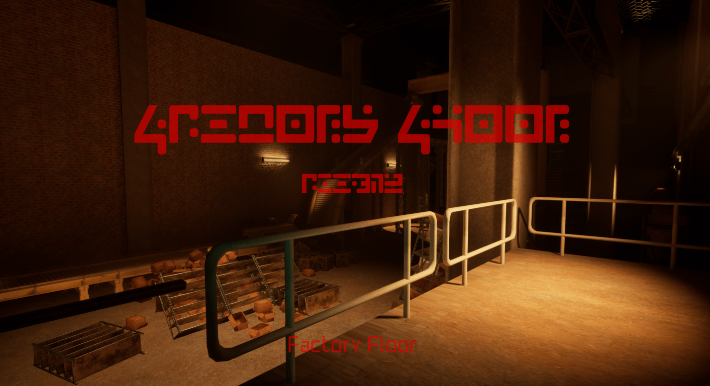
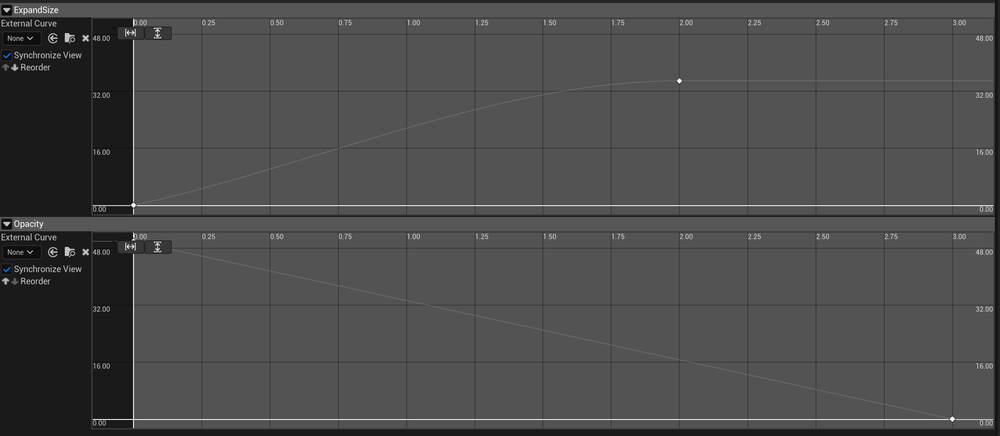
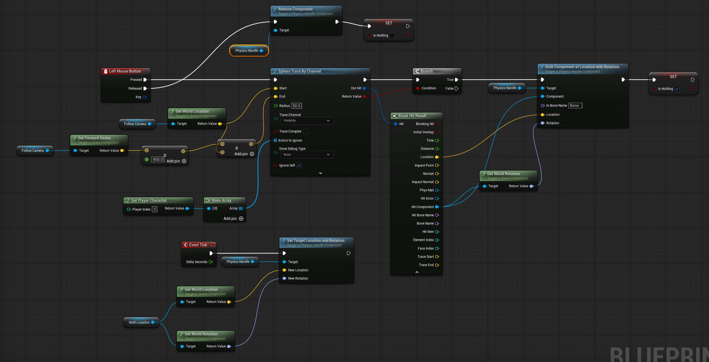
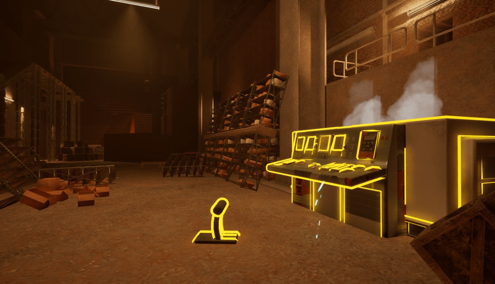
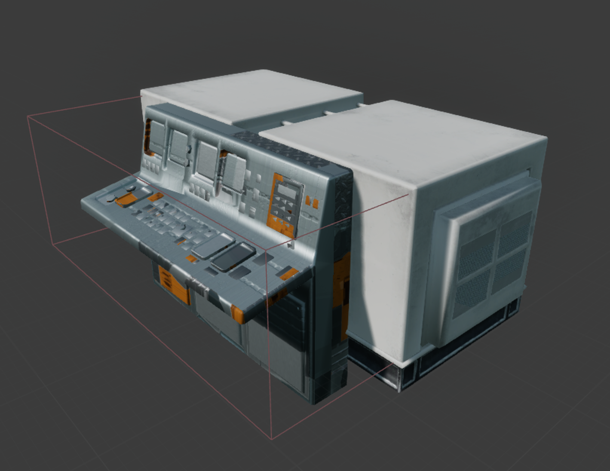
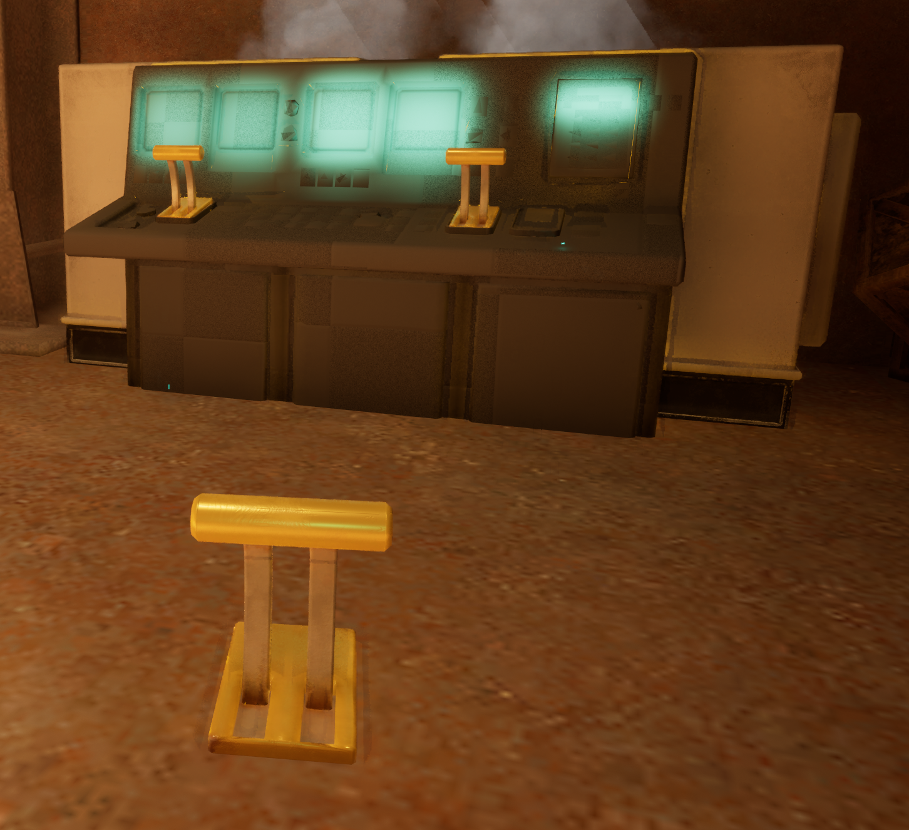
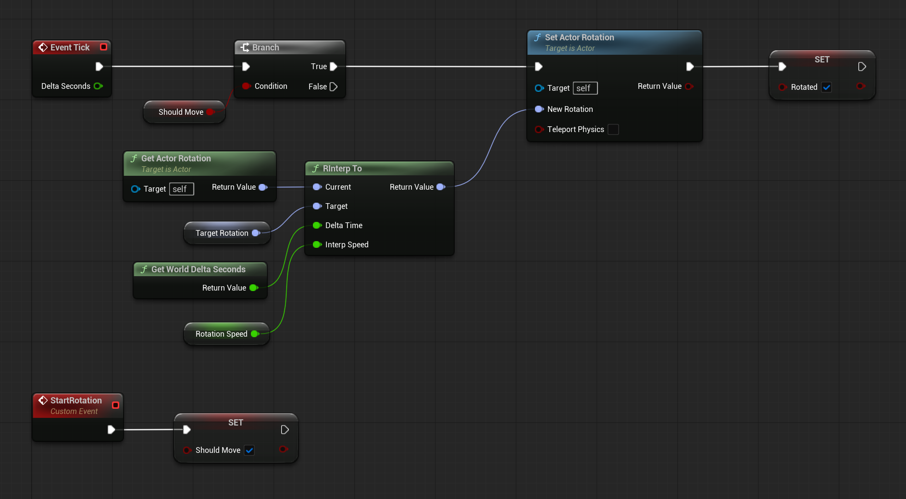
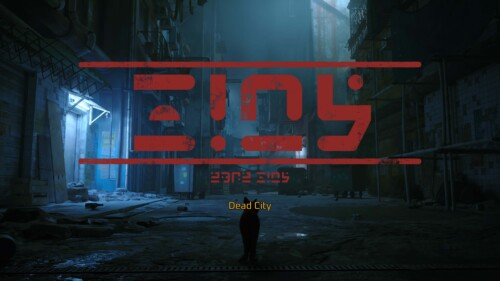
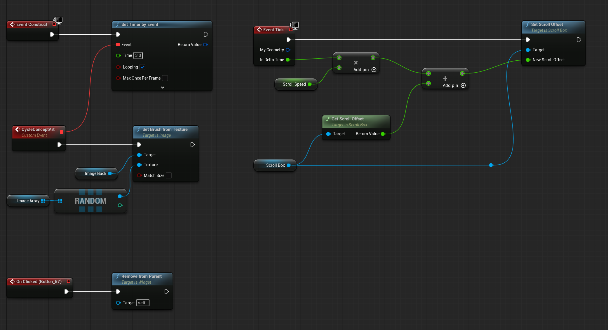
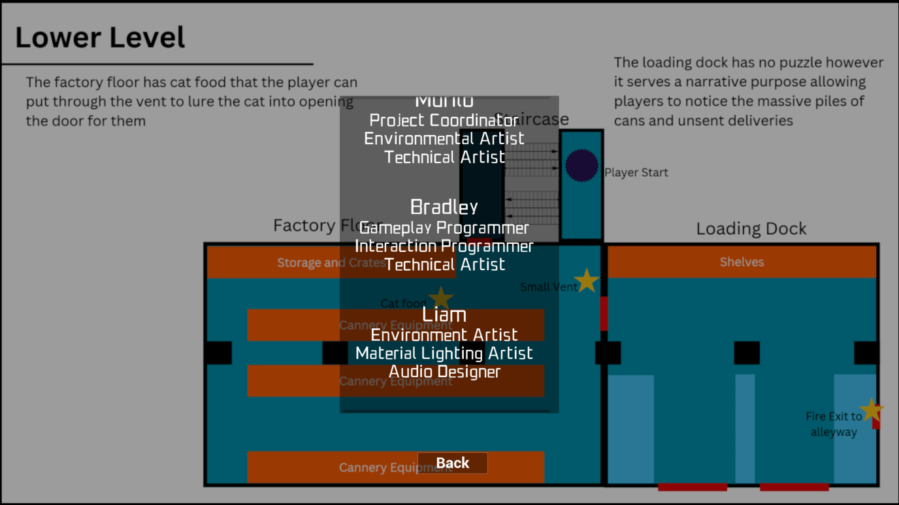

# 2309516 - Environmental Storytelling

## Exploring (Research & Inquiry)

### Concept & Inspiration

*   **Mood Boards**:
    *   As a group we put together a Figma board which has mood boards for the factory environment, UI elements such as widgets and fonts within the original game and a storyboard of how we wanted the initial cutscene to play out. 
    *   [Link to Figma board](https://www.figma.com/board/1UYfQkvr74c0H5pE9FhWsr/Environmental-Storytelling?node-id=0-1&t=lBZoQASadgRYAqbQ-1)

    

*   **Genre Analysis**:
    *   At the start of the first week we each took time to look at how environments tell stories within existing games to try and emulate a similar feeling. Games that came to mind were *Control* and *What remains of Edith Finch*. 
    *   In Control the environment is used to build a sense of corporate dread and surrealism through scattered memos and office layouts that feel both mundane and impossible. You might find a simple sticky note that reveals a terrifying supernatural containment failure which makes the cold concrete hallways feel alive and dangerous. On the other hand Edith Finch uses every inch of the family house to tell a more intimate and personal history. Each bedroom is a time capsule tailored to a specific character where the posters on the walls and the clutter on the floor explain who they were without ever needing a line of dialogue. While Control uses the world to explain its complex lore and mechanics Edith Finch uses it to create an emotional connection to a family that is already gone.
*   **Mechanic Research**:
    *   Researched scanning mechanics in other games (e.g., *Death Stranding*, *No Man's Sky*).
    *   Reference link: [Scanning Ability in 10 Minutes](https://www.reddit.com/r/unrealengine/comments/1m9dzu9/scanning_ability_in_10_minutes/)
*   **Initial Sketches**:
    *   [Briefly describe your paper prototypes or flowcharts]
    *   ![Image of initial sketches or paper  prototype]

## Making (Production & Iteration)

The core mechanics of the environment were built to support the narrative of discovery and interaction with the abandoned facility. The technical implementation focused on a modular "Scanner" system and a series of interconnected puzzle elements.

### 1. The Scanner Mechanic

The primary tool for navagating the environment is the Scanner. The scanner blueprint manages both the visual effect and the gameplay interaction.

*   **Logic**: The scanning process is driven by a custom event `DoScan`, which plays the `ExpandScan` Timeline. This timeline controls the growth of the scan radius over time.

*   **Visuals**: The timeline updates the actor's scale (`SetActorScale3D`) to simulate the expanding wave. Simultaneously, it drives a Scalar Parameter `Scan_Opacity` on the material `M_Scan`. This material uses a Depth Fade and Emissive Color (`Scan_Glow`) to create the holographic, "x-ray" aesthetic that reveals hidden geometry.

*   **Interaction**: To detect objects, the scanner uses a `Sphere` component. On `OnComponentBeginOverlap`, it checks if the overlapping actor implements the `BPI_Scannable` interface. If it does, the `OnScanned` function is called on that actor, allowing for distinct behaviors for different object types without hard references.

### 2. Interactive Objects

To bridge the gap between "looking" and "doing", I implemented a physics-based interaction system in `BP_ThirdPersonCharacter`. This allows the player to pick up specific objects such as the Levers and Tablets scattered around the environment.

*   **Trace & Grab Mechanics**:
    *   **Input**: The interaction is triggered by the `Left Mouse Button` 
    *   **Detection**: A `LineTraceByChannel` is fired from the camera's center forward vector. This ensures the player picks up exactly what they are looking at.
    *   **Physics Handle**: If the trace hits a valid physics object, the `PhysicsHandle` component is activated. `GrabComponentAtLocationWithRotation` attaches the object to the character's `HoldLocation` scene component.
    *   **Tick Update**: In the `ReceiveTick` event, the system continuously updates the Physics Handle's target location (`SetTargetLocationAndRotation`) to match the `HoldLocation`. This creates a smooth, laggy "towing" effect where the object physically follows the player's view rather than snapping rigidly.

    
*   **Interface Implementation**: `BP_Lever` implements the `BPI_Scannable` interface.

*   **Feedback**: When the `OnScanned` event is triggered by the scanner, the lever executes its specific feedback logic. In this case, it calls `SetOverlayMaterial` on its Static Mesh, applying `M_HighlightItem`. This visual cue immediately informs the player that the object is significant and interactive.
    ![BP_Lever Event Graph showing OnScanned event and SetOverlayMaterial]

### 3. The Puzzle Loop (Generator & Crane)

*   **The Generator (`BP_Generator`)**:
    *   **Puzzle Logic**: The actor functions as a "counter" using a Trigger Volume. It casts overlapping actors to `BP_Lever` and increments an integer `ItemsOnPad`. Initially the generator started as a Pressure pad in which you put boxes onto but to better fit the theme of the environment I changed it to be levers that are replaces on a control panel which then allow the crane to function.

    

    

*   **Visual Feedback**: To communicate progress without UI, the blueprint toggles the visibility of static mesh components (`Lever1`, `Lever2`, `Lever3`) as the count increases. This diegetic feedback confirms successful placement to the player.

    

*   **Consistency**: Like `BP_Lever`, the Generator implements `BPI_Scannable`. Its `OnScanned` event applies the same `M_HighlightItem` overlay, establishing a consistent visual language for interactable objects.

*   **The Crane (`BP_Crane`)**:
    *   As soon as the generator has all three levers in place it will call the `StartRotation` event on the crane. Upon receiving the `StartRotation` call, it sets a boolean `bShouldMove`.
    *   **Interpolation**: In `ReceiveTick`, it uses `RInterpTo` (Rotation Interpolation) to smoothly rotate the arm towards `TargetRotation` at a defined speed. This avoids jarring "snapping" movement, preserving immersion.
    

### 4. UI 

*   **New Area Popups**: In Stray, when the player enters a new area a popup will appear in which it has the areas name using the games unique font as well as an English translation below.

    
    https://interfaceingame.com/screenshots/stray-new-zone/

    
    *   **Implementation**:
        *   **Trigger (`BP_OfficeUI`)**: I created an actor that functions as a trigger. On `ReceiveActorBeginOverlap`, it checks if the overlapping actor is the player (`BP_ThirdPersonCharacter`). If confirmed, it creates the `WBP_Office` widget, adds it to the viewport, and immediately calls `DestroyActor` on itself. This ensures the popup only triggers once per playthrough.
        *   **Widget Logic (`WBP_Office`)**: The widget handles its own lifecycle to keep the implementation clean.
            *   **Construct**: When created, it enters a `Delay` of 5 seconds, keeping the text fully visible.
            *   **Animation**: After the delay, it plays the `FadeOut` animation, which modulates the `RenderOpacity` from 1 to 0.
            *   **Cleanup**: I used the `OnAnimationFinished` event to call `RemoveFromParent`, ensuring no invisible widgets remain in memory.

*   **Credits Screen (`BP_Credits`)**:
    *   **Auto-Scroll**: I implemented a scrolling mechanic in the `Tick` event. It takes the current `ScrollOffset` of the main ScrollBox and adds a `ScrollSpeed` variable multiplied by `DeltaTime`. This creates a smooth, frame-rate-independent rolling effect typically seen in films.
    *   **Concept Art Slideshow**: To make the credits visually engaging, I added a dynamic background.
        *   **Logic**: On `Construct`, a Timer is set to fire every 3 seconds.
        *   **Randomization**: The `CycleConceptArt` event picks a random texture from an `ImageArray` and updates the background image (`SetBrushFromTexture`). This showcases the team's concept art alongside their names.
    *   **Navigation**: A simple "Back" button allows the player to close the credits via `RemoveFromParent`, returning them to the main menu.

    

    

## Connecting (Collaboration)

### Teamwork & Workflow
"How did you work with the team?"

*   **Communication**:
    *   Describe the use of Discord/Slack for daily communication and "pivot-point" discussions.
    *   ![Screenshot of a key Discord discussion or decision]
*   **Agile Methodology**:
    *   Evidence of Sprint Reviews or Trello/Jira board usage.
    *   ![Screenshot of Trello/Jira board showing task progression]
*   **File Management**:
    *   Adherence to naming conventions (e.g., `BP_Name`, `M_Name`) to ensure seamless integration.
    *   Mention any merge conflict resolutions or version control practices.

## Situating & Synthesizing (Reflection - Context & Conclusion)

### Reflection & Justification
"What is the final result?" and "Why did you make these choices?"

*   **Final Result**:
    *   [Summarize the final look and feel of the project]
    *   ![Before and After comparison screenshots of a key area]
*   **Narrative Justification**:
    *   Explain *why* the scanner was the right choice for this story (e.g., "revealing the past").
    *   Explain how the visual style supports the mood (e.g., "cold, abandoned atmosphere").
*   **Critical Evaluation**:
    *   **Successes**: What went well? (e.g., The modularity of the scanner system).
    *   **Challenges**: What was difficult? (e.g., Optimizing the transparency shaders).
    *   **Future Improvements**: What would you add if you had more time? (e.g., More interactive object types).

- https://www.reddit.com/r/unrealengine/comments/1m9dzu9/scanning_ability_in_10_minutes/
- https://interfaceingame.com/screenshots/stray-new-zone/